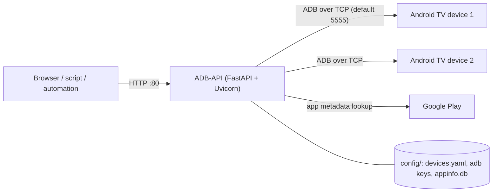

# ADB-API

[](https://hub.docker.com/r/techblog/adb-api)
[](LICENSE)

ADB-API is a Python-based application that helps you control Android TV streamers (such as the Xiaomi Mi Box) over the network.
It connects to your devices over ADB (Android Debug Bridge) and exposes them through a simple REST API built with FastAPI, plus a browser-based virtual remote.
It is aimed at home-automation users who want to drive their streamers from scripts, dashboards, or tools such as Home Assistant and n8n.

With ADB-API, you can easily do the following things:

* Use a virtual remote in your browser.
* List all configured devices.
* Get device properties (version, OS, and more).
* Get device memory usage.
* Get device CPU information.
* Get the list of installed applications (system and third-party), enriched with the app name, Google Play link, and icon.
* Open or close any installed app.
* Take a screenshot from the device.
* Execute shell commands.
* Send key events (a single key or a key chain).

## Table of Contents

- [Features](#features)
- [How It Works](#how-it-works)
- [Components and Libraries Used in ADB-API](#components-and-libraries-used-in-adb-api)
- [Requirements](#requirements)
- [Installation and Configuration](#installation-and-configuration)
- [Configuration Reference](#configuration-reference)
- [Working with ADB-API](#working-with-adb-api)
- [API Endpoints](#api-endpoints)
- [Security Notes](#security-notes)
- [Troubleshooting](#troubleshooting)
- [Development](#development)
- [Useful List of ADB Commands](#useful-list-of-adb-commands)
- [Contributing](#contributing)
- [License](#license)

## Features

* **Multi-device support** – every device listed in `devices.yaml` is connected at startup over ADB/TCP.
* **Virtual remote** – a Mi Box style remote at `/remotes/mibox` with a device selector, navigation (up/down/left/right/OK), Home, Back, and volume buttons.
* **Device information** – system properties (`getprop`), memory (`/proc/meminfo`), and CPU (`/proc/cpuinfo`).
* **App management** – list system and third-party packages, launch an app, or force-stop it.
* **App metadata cache** – app names, Google Play URLs, and icons are fetched with `google-play-scraper` and cached in a local SQLite database, so later calls are faster.
* **Screenshots** – capture the device screen and download it as a PNG.
* **Raw shell access** – run any `adb shell` command and get its output as a JSON list of lines.
* **Automatic key generation** – an ADB RSA key pair is generated on first start and stored in the config directory.
* **Interactive API docs** – Swagger UI at `/docs` (ReDoc at `/redoc`).
* **Multi-arch Docker image** – `linux/amd64`, `linux/arm64`, and `linux/arm/v7`.

## How It Works



1. On startup, ADB-API loads (or generates) its ADB RSA key pair from the config directory.
2. It reads `config/devices.yaml` and opens an ADB connection to each device. Devices that can't be reached at startup are skipped.
3. Each API call identifies the target device by its **IP address**, reconnects to it, and runs the matching `adb shell` command.
4. When listing apps, package details are looked up on Google Play (language `en`, country `il`) and cached in `config/appinfo.db`.

## Components and Libraries Used in ADB-API

* [FastAPI](https://fastapi.tiangolo.com/) - FastAPI framework, high performance, easy to learn, fast to code, ready for production.
* [Uvicorn](https://www.uvicorn.org/) - lightning-fast ASGI server implementation, using uvloop and httptools.
* [Jinja](https://jinja.palletsprojects.com/en/3.0.x/) - fast, expressive, extensible templating engine.
* [aiofile](https://pypi.org/project/aiofile/) - Real asynchronous file operations with asyncio support (from the `techblog/fastapi` base image; not imported by the app).
* [loguru](https://loguru.readthedocs.io/en/stable/api/logger.html) - An object to dispatch logging messages to configured handlers.
* [python-multipart](https://pypi.org/project/python-multipart/) - A streaming multipart parser for Python (from the `techblog/fastapi` base image; not imported by the app).
* [requests](https://docs.python-requests.org/en/latest/) - elegant and simple HTTP library for Python, built for human beings.
* [google-play-scraper](https://pypi.org/project/google-play-scraper/) - Google-Play-Scraper provides APIs to easily crawl the Google Play Store for Python without any external dependencies!
* [dataclasses-json](https://pypi.org/project/dataclasses-json/) - This library provides a simple API for encoding and decoding dataclasses to and from JSON.
* [adb-shell](https://pypi.org/project/adb-shell/) - A Python implementation of ADB with shell and FileSync functionality.
* [PyYAML](https://pypi.org/project/PyYAML/) - YAML parser and emitter for Python.

## Requirements

* One or more Android TV based devices (for example, Xiaomi Mi Box) with **Developer options** and **USB debugging** enabled, reachable from the ADB-API host over the network.
* Docker and Docker Compose (recommended), or Python 3 to run from source.
* The container/host must be able to reach each device's ADB port (usually `5555`).
* Outbound internet access if you want app names and icons from Google Play (optional; failures are logged and empty values are returned).

## Installation and Configuration

### 1. Enable developer mode on the streamer

In order to use ADB-API, you need to enable "Developer mode" on the Android TV based streamer. To do so, follow the next steps:

1. On your TV device, navigate to Settings.
2. In the Device row, select About.
3. Scroll down to Build and select Build several times until you get the message "You are now a developer!"
4. Return to Settings. In the Preferences row, select Developer options.
5. Select Debugging > USB debugging and select On.
6. Navigate back to the TV home screen.

> Some devices have a separate "Network debugging" / "ADB over network" option. If yours does, enable it as well so the device accepts ADB connections over TCP.

### 2. Run the container

Now that Developer mode is enabled, it's time to install the ADB-API Docker container. To do so, create a file named `docker-compose.yaml` and add the following code:

```yaml
version: "3.7"

services:

  adb_api:
    image: techblog/adb-api
    container_name: adb-api
    privileged: true
    restart: always
    ports:
      - "80:80"
    volumes:
      - ./adb-api/config:/app/config
```

Create a folder named `adb-api/config` at the same level as the YAML file, and create a new file named `devices.yaml` inside it with the following content:

```yaml
devices:

  - id: 1
    name:
    ip:
    port:

  - id: 2
    name:
    ip:
    port:
```

And update the devices list according to your devices' details, for example:

```yaml
devices:

  - id: 1
    name: Mibox Work-Room
    ip: 192.168.0.12
    port: 5555
```

***You can set the path for the config directory. The one in the code sample is just an example.***

Now, run the following command to install and start the container:

```bash
docker compose up -d
```

(Use `docker-compose up -d` if you still run the standalone Compose v1 binary.)

Or, with plain Docker:

```bash
docker run -d --name adb-api --privileged --restart always \
  -p 80:80 -v "$(pwd)/adb-api/config:/app/config" techblog/adb-api
```

After the container starts, more files will be added to the config directory:

1. Two key files for connecting to the devices (`adb` and `adb.pub`, the ADB RSA key pair).
2. An SQLite database (`appinfo.db`) that caches app details to speed up the app-list API calls.

If `devices.yaml` doesn't exist, the default template (with empty values) is copied into the config directory; fill it in and restart the container.

You will also see the following message pop up on each of your streamers:

[](https://techblog.co.il/wp-content/uploads/2023/04/usb-debug.png)

Make sure to check the "Always allow from this computer" checkbox and click the OK button. You will also need to restart the container (devices are only registered if the connection succeeds at startup).

## Configuration Reference

ADB-API has no environment variables or command-line flags that change its behavior. All configuration lives in the config directory (`/app/config` inside the container).

### `devices.yaml`

| Key | Type | Required | Description |
|-----|------|----------|-------------|
| `devices` | list | yes | List of devices to connect to at startup. |
| `devices[].id` | integer | yes | Numeric identifier, returned by `/api/devices`. |
| `devices[].name` | string | yes | Display name (shown in the virtual remote's device selector). |
| `devices[].ip` | string | yes | Device IP address. This is the value used as `{device}` in every API call. |
| `devices[].port` | integer | yes | ADB TCP port, usually `5555`. |

### Files and ports

| Item | Value | Description |
|------|-------|-------------|
| HTTP port | `80` | Fixed in the code (`uvicorn.run(..., port=80)`). Map it to another host port with `-p <host-port>:80`. |
| Config volume | `/app/config` | Holds `devices.yaml`, `adb`, `adb.pub`, and `appinfo.db`. Persist it. |
| ADB private key | `config/adb` | Generated on first start if missing. |
| ADB public key | `config/adb.pub` | Generated on first start if missing. |
| App cache | `config/appinfo.db` | SQLite cache of Google Play app details. |
| Screenshots | `/app/dist/screenshots/` | Screenshots pulled from devices (not in the config volume). |
| Docker image | `techblog/adb-api` | Tags: `latest` and the version from the `VERSION` file (e.g. `2.2.0`). |

> The Dockerfile sets `LOG_LEVEL=DEBUG`, but the application code does not read it.

## Working with ADB-API

### Swagger / OpenAPI

ADB-API also includes OpenAPI (Swagger) documentation to help you work with the system. With Swagger you can test the API calls very easily.

To access the Swagger documentation, add `/docs` to the end of the server URL, for example: `http://[server-address]:[port]/docs`

[](https://techblog.co.il/wp-content/uploads/2023/04/adb-api-swagger.png)

### Virtual remote

Open `http://[server-address]:[port]/remotes/mibox` in a browser, pick a device from the drop-down list, and use the buttons. Each button sends a key event through `GET /api/{device}/{keyevent}`:

| Button | Key event |
|--------|-----------|
| Volume up / down | `24` / `25` |
| Left / Right | `21` / `22` |
| Up / Down | `19` / `20` |
| OK | `66` |
| Home | `3` |
| Back | `4` |

The Power and Microphone buttons have no key event assigned in the current template.

<!-- TODO: screenshot of the virtual remote (/remotes/mibox) -->

### Examples with curl

```bash
# List devices
curl http://localhost/api/devices

# Press Home on 192.168.0.12
curl http://localhost/api/192.168.0.12/3

# Press Volume Down twice (space URL-encoded as %20)
curl "http://localhost/api/192.168.0.12/25%2025"

# Open Plex
curl http://localhost/api/192.168.0.12/com.plexapp.android/open

# Read the system volume
curl "http://localhost/api/192.168.0.12/execute/settings%20get%20system%20volume_system"

# Save a screenshot
curl -o screen.png http://localhost/api/screenshot/get/192.168.0.12/screen
```

## API Endpoints

All endpoints use `GET`. `{device}` is always the IP address of the streamer as configured in `devices.yaml`.

| Path | Description |
|------|-------------|
| `/api/devices` | List the devices from `devices.yaml`. |
| `/api/{device}/properties` | Device system properties (`getprop`). |
| `/api/{device}/memory` | Memory info (`/proc/meminfo`). |
| `/api/{device}/cpu` | CPU info (`/proc/cpuinfo`) plus core count (see note below). |
| `/api/{device}/apps/system` | Installed system apps with Google Play details. |
| `/api/{device}/apps/3rd` | Installed third-party apps with Google Play details. |
| `/api/{device}/{keyevent}` | Send one or more key events (`input keyevent ...`). |
| `/api/{device}/{app}/open` | Launch an app by package name. |
| `/api/{device}/{app}/close` | Force-stop an app by package name. |
| `/api/{device}/execute/{command}` | Run a shell command and return its output lines. A command that is literally `open` or `close` is caught by the app open/close routes, which are declared first. |
| `/api/screenshot/get/{device}/{image}` | Take a screenshot and return it as a PNG file. |
| `/remotes/{remote}` | Render a virtual remote template (currently `mibox`). |
| `/docs`, `/redoc`, `/openapi.json` | API documentation generated by FastAPI. |

* Get devices list: `/api/devices`. Returns JSON with the registered devices.

```json
{
  "devices": [
    {
      "id": 1,
      "name": "Mibox Work-Room",
      "ip": "192.168.0.12",
      "port": 5555
    },
    {
      "id": 2,
      "name": "Mibox Parents",
      "ip": "192.168.0.235",
      "port": 5555
    }
  ]
}
```

* Get device properties: `/api/{device}/properties`. Returns JSON with the device properties (dots in property names are replaced with underscores). The `device` parameter is the IP address of the streamer. Example (truncated):

```json
{
  "net_bt_name": " Android",
  "persist_sys_locale": " he-IL",
  "persist_sys_media_avsync": " true",
  "persist_sys_timezone": " Asia/Jerusalem",
  "persist_sys_usb_config": " adb",
  "persist_sys_webview_vmsize": " 139176216",
  "pm_dexopt_ab-ota": " speed-profile",
  "pm_dexopt_bg-dexopt": " speed-profile",
  "pm_dexopt_boot": " verify",
  "pm_dexopt_first-boot": " quicken",
  "pm_dexopt_inactive": " verify",
  "pm_dexopt_install": " speed-profile",
  "pm_dexopt_priv-apps-oob": " false",
  "pm_dexopt_priv-apps-oob-list": " ALL",
  "pm_dexopt_shared": " speed",
  "ro_actionable_compatible_property_enabled": " true",
  "ro_adb_secure": " 1",
  "ro_allow_mock_location": " 0",
  "ro_boot_hardware": " amlogic",
  "ro_boot_oemkey1": " ATV00100021M19",
  "ro_boot_reboot_mode": " cold_boot",
  "ro_boot_rpmb_state": " 0",
  "ro_boot_selinux": " enforcing",
  "ro_boot_serialno": " 18554284042375",
  "ro_boot_vbmeta_avb_version": " 1.1",
  "ro_boot_vbmeta_device": " /dev/block/vbmeta",
  "ro_boot_vbmeta_device_state": " locked",
  "ro_bootimage_build_date": " Tue Sep 28 18",
  "ro_bootimage_build_date_utc": " 1632823795",
  "ro_bootimage_build_fingerprint": " Xiaomi/oneday/oneday",
  "ro_bootloader": " unknown",
  "ro_bootmode": " unknown",
  "ro_build_characteristics": " default",
  "ro_build_date": " Tue Sep 28 18",
  "ro_build_date_utc": " 1632823795",
  "ro_build_description": " oneday-user 9 PI 3933 release-keys",
  "ro_build_display_id": " PI.3933 release-keys",
  "ro_build_expect_bootloader": " 01.01.180822.145544",
  "ro_build_fingerprint": " Xiaomi/oneday/oneday",
  "ro_build_flavor": " oneday-user",
  "ro_build_host": " c5-mitv-bsp-build04.bj",
  "ro_build_id": " PI",
  "ro_build_software_version": " 21.9.28.3933",
  "ro_build_system_root_image": " true",
  "ro_build_user": " jenkins",
  "ro_build_version_preview_sdk": " 0",
  "ro_build_version_release": " 9",
  "ro_build_version_sdk": " 28",
  "ro_com_google_clientidbase": " android-xiaomi-tv",
  "ro_com_google_gmsversion": " Android_9_Pie",
  "ro_config_notification_sound": " pixiedust.ogg",
  "ro_product_brand": " Xiaomi",
  "ro_product_build_date": " Tue Sep 28 18",
  "ro_product_build_date_utc": " 1632823795",
  "ro_product_build_fingerprint": " Xiaomi/oneday/oneday",
  "ro_product_cpu_abi": " armeabi-v7a",
  "ro_product_cpu_abi2": " armeabi",
  "ro_product_cpu_abilist": " armeabi-v7a,armeabi",
  "ro_product_cpu_abilist32": " armeabi-v7a,armeabi",
  "ro_product_cpu_abilist64": " ",
  "ro_product_device": " oneday",
  "ro_product_first_api_level": " 28",
  "ro_product_locale": " en-US",
  "ro_product_manufacturer": " Xiaomi",
  "ro_product_model": " MIBOX4",
  "ro_product_name": " oneday",
  "ro_product_vendor_brand": " Xiaomi",
  "ro_product_vendor_device": " oneday",
  "ro_product_vendor_manufacturer": " Xiaomi",
  "ro_product_vendor_model": " MIBOX4",
  "ro_product_vendor_name": " oneday"
}
```

* Get device memory info: `/api/{device}/memory`. Returns the device memory info.

```json
{
  "MemTotal": "2034840 kB",
  "MemFree": "169388 kB",
  "MemAvailable": "1076044 kB",
  "Buffers": "30816 kB",
  "Cached": "996968 kB",
  "SwapCached": "0 kB",
  "Active": "911756 kB",
  "Inactive": "622644 kB",
  "Active(anon)": "508824 kB",
  "Inactive(anon)": "2156 kB",
  "Active(file)": "402932 kB",
  "Inactive(file)": "620488 kB",
  "Unevictable": "2340 kB",
  "Mlocked": "2340 kB",
  "SwapTotal": "262140 kB",
  "SwapFree": "262140 kB",
  "Dirty": "0 kB",
  "Writeback": "0 kB",
  "AnonPages": "508964 kB",
  "Mapped": "532488 kB",
  "Shmem": "2508 kB",
  "Slab": "106952 kB",
  "SReclaimable": "49936 kB",
  "SUnreclaim": "57016 kB",
  "KernelStack": "21504 kB",
  "PageTables": "27004 kB",
  "NFS_Unstable": "0 kB",
  "Bounce": "0 kB",
  "WritebackTmp": "0 kB",
  "CommitLimit": "1279560 kB",
  "Committed_AS": "23159644 kB",
  "VmallocTotal": "263061440 kB",
  "VmallocUsed": "0 kB",
  "VmallocChunk": "0 kB",
  "CmaTotal": "544768 kB",
  "CmaFree": "0 kB",
  "VmapStack": "5496 kB"
}
```

* Get device CPU info: `/api/{device}/cpu`. Returns a `cores` count plus the key/value pairs from `/proc/cpuinfo`. Note: `cores` is currently read from the first configured device, not from `{device}`.

* Get the list of installed applications: `/api/{device}/apps/3rd` (third-party) or `/api/{device}/apps/system` (system). Returns a list of installed applications with basic info. The first lookup of each app queries Google Play, so it can be slow; later calls are served from the SQLite cache.

```json
{
  "com.plexapp.android": {
    "appname": "Plex: Stream Movies & TV",
    "appurl": "https://play.google.com/store/apps/details?id=com.plexapp.android&hl=en&gl=il",
    "appimage": "https://play-lh.googleusercontent.com/slZYN_wnlAZ4BmyTZZakwfwAGm8JE5btL7u7AifhqCtUuxhtVVxQ1mcgpGOYC7MsAaU"
  },
  "il.co.yes.yesgo": {
    "appname": "yes+",
    "appurl": "https://play.google.com/store/apps/details?id=il.co.yes.yesgo&hl=en&gl=il",
    "appimage": "https://play-lh.googleusercontent.com/8AgNls4adb1Wsp4ZxGGoaSecwbiBT1wmY1cgRLEwjhltrlS2lNcanpXLT_5IidJpbA"
  },
  "il.co.stingtv.atv": {
    "appname": "STINGTV",
    "appurl": "https://play.google.com/store/apps/details?id=il.co.stingtv.atv&hl=en&gl=il",
    "appimage": "https://play-lh.googleusercontent.com/NrUvKI1NcsLk6_hNxZtxWENvDyuQNvTDvoJqZFmuuFrKcml-5bygxM_oJNyYyTFXBpo"
  },
  "miada.tv.webbrowser": {
    "appname": "Internet Web Browser",
    "appurl": "https://play.google.com/store/apps/details?id=miada.tv.webbrowser&hl=en&gl=il",
    "appimage": "https://play-lh.googleusercontent.com/wui_0K9RipIlFKLsSbAPFaI9-f6PA4INZ0GKZDThsi57Jm-Olw04T_pqtufhNaTKLw"
  },
  "com.spotify.tv.android": {
    "appname": "Spotify - Music and Podcasts",
    "appurl": "https://play.google.com/store/apps/details?id=com.spotify.tv.android&hl=en&gl=il",
    "appimage": "https://play-lh.googleusercontent.com/eN0IexSzxpUDMfFtm-OyM-nNs44Y74Q3k51bxAMhTvrTnuA4OGnTi_fodN4cl-XxDQc"
  },
  "com.greenshpits.RLive": {
    "appname": "Radio Live Israel radio online",
    "appurl": "https://play.google.com/store/apps/details?id=com.greenshpits.RLive&hl=en&gl=il",
    "appimage": "https://play-lh.googleusercontent.com/c5hWYKQ0BJioIyoPegJiibjz93PBYVGT0BUrRCoHvkx_bnqkBCQf91752R7BTKEzIro"
  },
  "com.android.chrome": {
    "appname": "Google Chrome: Fast & Secure",
    "appurl": "https://play.google.com/store/apps/details?id=com.android.chrome&hl=en&gl=il",
    "appimage": "https://play-lh.googleusercontent.com/KwUBNPbMTk9jDXYS2AeX3illtVRTkrKVh5xR1Mg4WHd0CG2tV4mrh1z3kXi5z_warlk"
  }
}
```

* Execute command: `/api/{device}/execute/{command}`. Returns the command output as a list of lines. For example, getting the current system volume:
the command `settings get system volume_system` (`/api/192.168.0.12/execute/settings%20get%20system%20volume_system`) will return the following output:

```json
[
  "7"
]
```

  A `/` can't be used directly inside the path parameter; encode it as `&#47;` (URL-encoded: `%26%2347%3B`) and the API converts it back to `/`.

* Send key events: `/api/{device}/{keyevent}`. This endpoint simulates one or more key presses by running `input keyevent {keyevent}` on the device.
For example, `/api/192.168.0.12/3` simulates clicking the **"Home"** button, and `/api/192.168.0.12/25%2025` (`input keyevent 25 25`) simulates two clicks on the **"Volume Down"** button. Response:

```json
{
  "success": true,
  "message": "keyevent command executed successfuly"
}
```

* Open application: `/api/{device}/{app}/open`. This endpoint opens the requested application. For example, `/api/192.168.0.12/com.plexapp.android/open` will open the "Plex" application.

* Close application: `/api/{device}/{app}/close`. Force-stops the application (`am force-stop`). For example, `/api/192.168.0.12/com.plexapp.android/close`.

* Take a screenshot: `/api/screenshot/get/{device}/{image}`. Captures the screen, pulls it from the device, deletes the temporary file on the device, and returns `{image}.png`. The file is also kept in the container at `/app/dist/screenshots/{image}.png` and served at `/dist/screenshots/{image}.png`.

> The code also defines `/api/{device}/start?activity=<package/activity>` (runs `am start -n`), but it is declared after `/api/{device}/{keyevent}`, which matches the same path first, so the request is handled as a key event.

## Security Notes

* **No authentication.** The API has no authentication or authorization, and `/api/{device}/execute/{command}` runs arbitrary shell commands on your devices. Keep ADB-API on a trusted local network and don't expose it to the internet; if you need remote access, put it behind a VPN or an authenticating reverse proxy.
* **ADB keys.** At startup the application uses the key pair in `config/adb` and `config/adb.pub`, and generates a new pair there if either file is missing. Each installation therefore gets its own key, and the TV must authorize it (the "Allow USB debugging" prompt).
* **Bundled key pair.** The repository also contains an RSA key pair in `app/keys/` (and it is copied into the image). The application code does not use it. Because that private key is public, never copy it into your config directory or authorize it on your devices; let ADB-API generate its own key. To rotate your key, delete `config/adb` and `config/adb.pub`, restart the container, and accept the new prompt on each device.
* **Privileged container.** The sample Compose file runs the container with `privileged: true`. <!-- TODO: verify whether privileged mode is needed for TCP-only use -->
* **Protect the config volume.** It contains the ADB private key, which grants shell access to every device that has authorized it.

## Troubleshooting

* **The container exits right after start.** The app accesses the first connected device when it starts, so it fails if no device in `devices.yaml` could be connected. Make sure at least one device is powered on, reachable, and has authorized the key, then restart.
* **Startup error with the default `devices.yaml`.** Every entry needs a `name`, `ip`, and `port`. Remove unused entries instead of leaving them empty.
* **A device returns an error (HTTP 500, or `"success": false` for key events).** Devices that couldn't be connected at startup aren't registered. Accept the "Allow USB debugging" prompt on the TV and restart the container. Also make sure you use the device's IP exactly as written in `devices.yaml`.
* **The "Allow USB debugging" prompt keeps coming back.** Check "Always allow from this computer" and keep the config volume persistent so the key isn't regenerated.
* **App names or icons are empty.** The Google Play lookup failed (for example, no internet access or the app isn't on Google Play). Results, including empty ones, are cached in `appinfo.db`; delete that file to force a new lookup.

## Development

The Docker image is built on `techblog/fastapi`, which provides FastAPI, Uvicorn, Jinja2, loguru, and requests; `requirements.txt` only lists the extra packages.

Run from source:

```bash
git clone https://github.com/t0mer/adb-api.git
cd adb-api
pip install -r requirements.txt fastapi uvicorn jinja2 loguru requests
cd app
mkdir -p config
# create config/devices.yaml (see above), then:
sudo python3 app.py   # listens on 0.0.0.0:80
```

The app must be started from the `app/` directory, because it uses relative paths (`config/`, `dist/`, `templates/`).

Project layout:

```
app/
  app.py              # FastAPI app, routes, ADB connections
  androiddevice.py    # device model
  sqliteconnector.py  # SQLite cache for app details
  devices.yaml        # default devices template
  templates/mibox.html
  dist/mibox/         # remote images
Dockerfile
VERSION               # image version tag
.github/workflows/    # Docker Hub and JFrog build workflows (manual dispatch)
```

The Docker Hub image is built by the manually triggered `Docker Build` workflow for `linux/amd64`, `linux/arm64`, and `linux/arm/v7`, and tagged `latest` and the version in `VERSION`.

## Useful List of ADB Commands

I have published a list of useful ADB commands [here](https://gist.github.com/t0mer/37b384a37941c25d1e7206849b10967f).

## Contributing

Issues and pull requests are welcome at [github.com/t0mer/adb-api](https://github.com/t0mer/adb-api).

## License

This project is licensed under the [MIT License](LICENSE).
